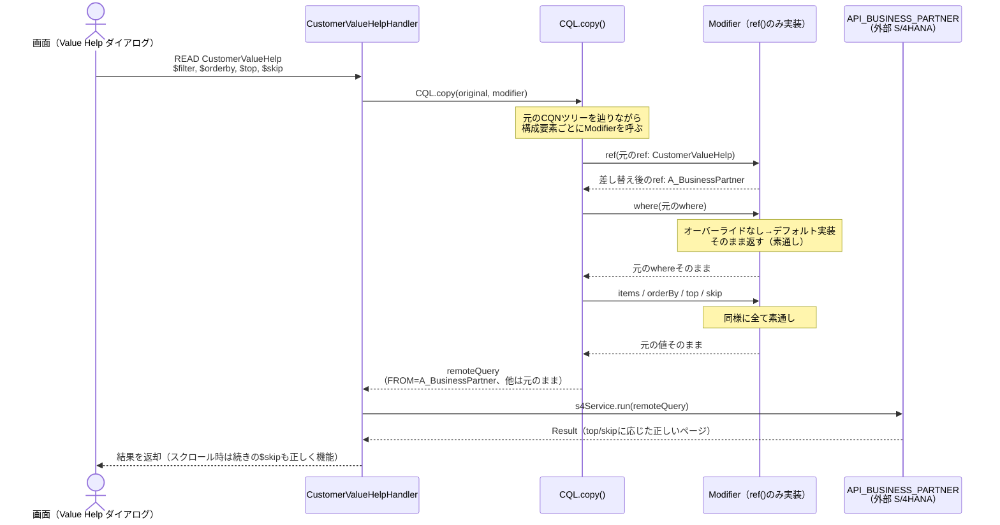

# CustomerValueHelpHandler 設計ドキュメント

`BusinessPartnerService.CustomerValueHelp`（取引先 Value Help）の READ ハンドラ。

UI から来たクエリ（`$filter` / `$orderby` / `$top` / `$skip` などを含む CQN）を、
**FROM句（対象エンティティ）だけ** 別のエンティティ（S4 の `A_BusinessPartner`）に
すり替えて外部サービスへそのまま委譲する。

> 実装ファイル: `srv/src/main/java/customer/verification/handler/CustomerValueHelpHandler.java`

---

## なぜこのハンドラが必要か

`CustomerValueHelp` は `@cds.persistence.skip` な独立エンティティ（`SalesMashupList` と同じ設計思想）。
DB テーブルを持たないため、CAP は READ イベントを自動委譲できず、このハンドラへ完全に委譲する。

```cds
@readonly
@cds.persistence.skip
entity CustomerValueHelp {
  key BusinessPartner          : String(10);
      BusinessPartnerFullName  : String(81);
      BusinessPartnerCategory  : String(1);
      BusinessPartnerIsBlocked : Boolean;
      CreationDate              : Date;
};
```

---

## 過去にあった不具合パターン（やってはいけない実装）

```java
// NG: WHERE句だけ取り出して手でCQNを再構築するパターン
CqnPredicate where = ctx.getCqn().where().orElse(null);
var query = Select.from(S4_ENTITY).where(where); // ← items/orderBy/top/skip が消える
```

`ctx.getCqn()` は WHERE句だけでなく、`items`（射影）・`orderBy`・`top`・`skip`・
キー述語・`search` などクエリ全体を保持している。WHERE句だけ取り出して
新しいクエリを組み立て直すと、**$top / $skip が失われる**。

その結果:

- Value Help がスクロールしても `$skip` が反映されない（毎回同じ先頭N件が返る）
- $top を明示的に付けないと `cds.query.limit.max`（デフォルト1000件）が効き、
  1000件で頭打ちになる
- 「返却件数 == 要求 $top」という Value Help の成長判定（まだ続きがあるかの判定）が壊れる

---

## 修正方針: `CQL.copy()` + `Modifier`

```java
CqnSelect original = ctx.getCqn();

Modifier fromOnlyModifier = new Modifier() {
    @Override
    public CqnStructuredTypeRef ref(CqnStructuredTypeRef ref) {
        if (ref.segments().size() > 1) {
            throw new ServiceException(ErrorStatuses.NOT_IMPLEMENTED,
                "CustomerValueHelp はナビゲーション経由の READ に対応していません");
        }
        return CQL.to(CQL.refSegment(S4_ENTITY)).asRef();
    }
};

CqnSelect remoteQuery = CQL.copy(original, fromOnlyModifier);

Result result = s4Service.run(remoteQuery);
```

### なぜこれで items / orderBy / top / skip / where が自動的に引き継がれるのか

`CQL.copy(statement, modifier)` は元の CQN ツリーを辿りながら、
各構成要素（`ref` / `where` / `items` / `orderBy` / `top` / `skip` / ...）ごとに
対応する `Modifier` のメソッドを1つずつ呼び出し、その戻り値でコピーを組み立てる
「ビジターパターン」的な仕組み。

`Modifier` インターフェースは各メソッドにデフォルト実装を持っており、
デフォルトは **「渡された値をそのまま返す」**（素通し）。

```java
// Modifier インターフェースの実際のデフォルト実装（抜粋）
default CqnPredicate where(Predicate where) { return where; }
default List<CqnSelectListItem> items(List<CqnSelectListItem> items) { return items; }
default List<CqnSortSpecification> orderBy(List<CqnSortSpecification> sortSpecs) { return sortSpecs; }
default long top(long top) { return top; }
default long skip(long skip) { return skip; }
```

`CustomerValueHelpHandler` の `Modifier` 実装は **`ref()` だけをオーバーライド**している。
つまり FROM句を組み立てるタイミングでだけ独自処理が挟まり、それ以外（WHERE・射影・
ソート順・ページング指定）は全部デフォルト実装（素通し）が使われる＝元のクエリの内容が
そのままコピー先に引き継がれる。



### ナビゲーション経由の READ を弾く理由

`ref.segments()` が複数ある場合（例: 別エンティティ経由のナビゲーションプロパティとして
呼ばれた場合）、キー述語が ref のセグメント側に埋め込まれている可能性がある。
本ハンドラは ref を丸ごと新しい ref に差し替えるため、その場合キー述語が消えてしまう。
対応していないパターンとして明示的に `ServiceException` を投げてガードしている。

---

## この実装は SAP 推奨実装か？

**結論: はい、SDKが正式に提供している拡張ポイントを使った、CAP流の正攻法。**

- `CQL.copy(CqnStatement, Modifier)` と `Modifier` インターフェースは `cds4j-api` の
  公開APIとして提供されている（`com.sap.cds.ql.CQL` / `com.sap.cds.ql.cqn.Modifier`）。
- `Modifier` の javadoc 自体が「CQN の predicate / value / statement の特定の部分だけを
  差し替えるためのプロバイダーインターフェース」と明記しており、まさに今回のような
  「一部だけ書き換えて残りは維持する」ユースケース向けに設計されている。
- CAP自身の内部実装（projection の解決やリモートサービスへの委譲処理など）でも
  同種の仕組みが使われており、車輪の再発明ではなく標準機構に乗っている。

一方で断っておくと、「Value Help のページング不具合の直し方」としてこの実装パターン名を
名指ししたSAP公式ドキュメント（capire等）のページを直接確認したわけではない。
上記の判断根拠は cds4j-api 4.4.2 の javadoc とAPI設計から読み取れる設計意図に基づく。
少なくとも「WHEREだけ取り出して手でCQNを再構築する」自己流のアンチパターンよりも、
公式APIの意図に沿った実装であることは確か。

---

## 関連ファイル

| ファイル | 役割 |
|---|---|
| `srv/service.cds` | `CustomerValueHelp` エンティティ定義（`BusinessPartnerService`） |
| `srv/src/main/java/customer/verification/handler/CustomerValueHelpHandler.java` | 本ハンドラ本体 |
| `srv/src/test/java/customer/verification/handler/CustomerValueHelpHandlerTest.java` | 4000件超データでのページング検証テスト |
